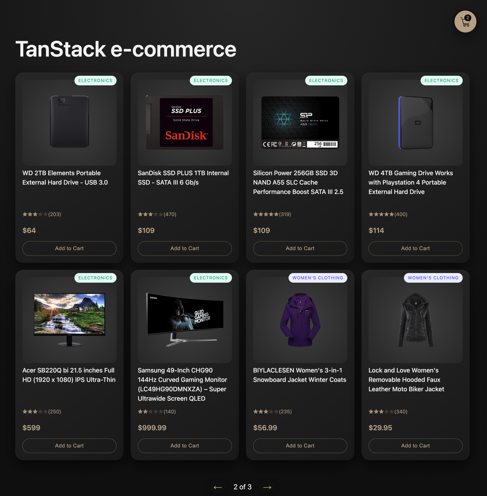
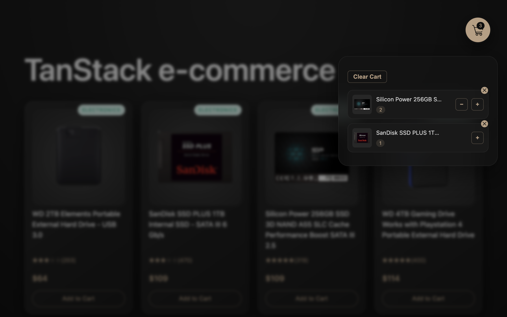
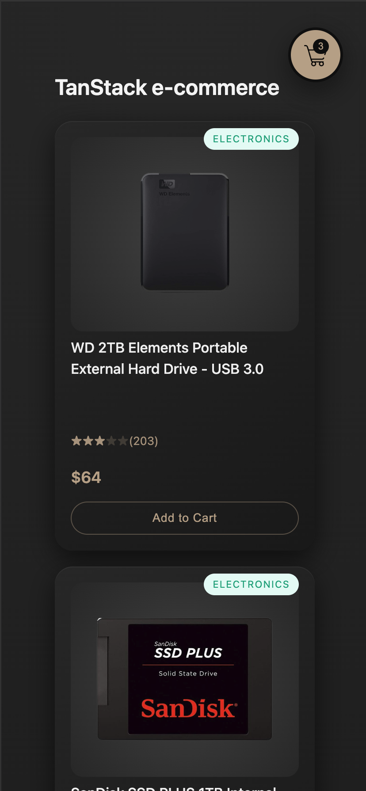
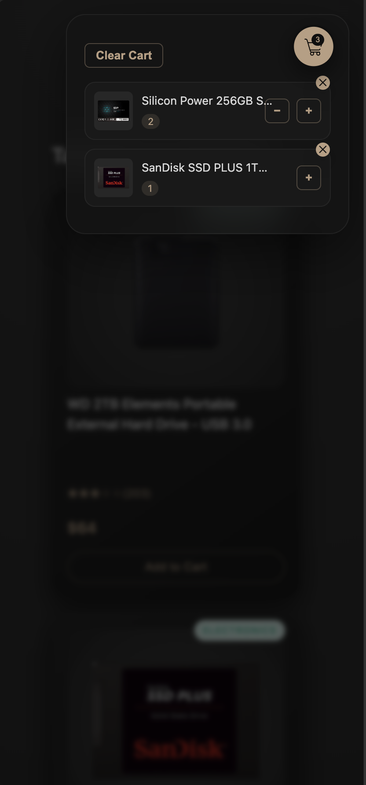

<h1 align="center">🛒 TanStack Storefront Exercise</h1>

<p align="center">
A former sound designer turned front-end developer, I enjoy transforming ideas and UI mockups into elegant, responsive products.<br/>
This project is a hands-on exploration of modern React architecture and the TanStack ecosystem.<br/>
It focuses on building a polished ecommerce interface while experimenting with real-world data patterns and UX decisions.
</p>

<br/>

## 🎯 Project Purpose

This project was built as a learning sandbox to:

- explore **TanStack Query** in a real UI
- practice scalable React architecture
- implement realistic ecommerce UX patterns
- experiment with caching, optimistic updates & offline persistence
- refine UI polish & responsiveness

---

## ✨ Key Features

✔ TanStack Query data fetching & caching  
✔ Optimistic cart updates  
✔ Offline cache persistence  
✔ Product detail modal  
✔ Responsive sidebar cart (mobile slide-in)  
✔ Skeleton loading states  
✔ Dark & light theme  
✔ Clean & scalable component structure

---

## 🧰 Tech Stack

<p align="center">
  
  
  
  
  
</p>

---

### State Strategy

- Server state → TanStack Query
- UI state → React state
- Cart state → local state with optimistic updates

---

## 🔄 Data Flow

API → TanStack Query → custom hooks → UI components

---

## ⚡ Why TanStack Query?

TanStack Query handles server state complexity by providing:

- automatic caching & background refetching
- stale data & request deduplication
- optimistic updates support
- offline persistence
- improved UX with minimal code

This keeps UI components simple and focused.

---

## 📸 Screenshot

### Desktop

<p align="center">
  
  
</p>

### Mobile

<p align="center">
  
  
</p>

---

## 🚀 Run Locally

```bash
git clone https://github.com/GutuGaluppo/tanstack-test.git
cd tanstack-test
npm install
npm run dev
```
